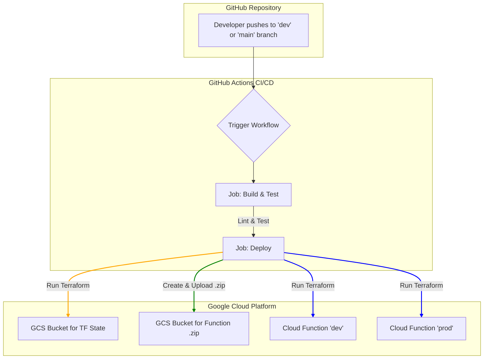

# **GCP Serverless Pipeline**

[](https://www.google.com/search?q=https://github.com/YOUR_USERNAME/YOUR_REPOSITORY/actions/workflows/ci-cd.yml)
[](https://opensource.org/licenses/MIT)

A complete, automated CI/CD pipeline to build, test, and deploy a Python serverless function on the Google Cloud Platform. This project demonstrates best practices for Infrastructure as Code (IaC), multi-environment workflows, and automated testing.

## **🚀 Key Features**

  * **Automated CI/CD:** The entire lifecycle is managed by a GitHub Actions pipeline.
  * **Multi-Environment Deployment:** Automatically deploys to a `dev` or `prod` environment based on the Git branch (`dev` vs. `main`).
  * **Infrastructure as Code (IaC):** All GCP resources are provisioned and managed by **Terraform**.
  * **Remote State Management:** Terraform state is securely stored and managed in a GCS bucket to ensure consistency across all environments.
  * **Custom SDK:** Includes a custom Python SDK to interact with the deployed function and perform sanity checks.
  * **Automated Testing & Linting:** Code quality is maintained with `pytest` for testing and `flake8` for linting.

-----

## **🏛️ Architecture Diagram**

The diagram below illustrates the flow from a `git push` to the final deployment on GCP.



-----

## **🛠️ Tech Stack**

| Tool | Purpose |
| :--- | :--- |
|  **Google Cloud** | Cloud Provider & Hosting |
|  **GitHub Actions** | CI/CD Automation |
|  **Terraform** | Infrastructure as Code |
|  **Python** | Application & SDK Language |
|  **Pytest** | Testing Framework |
|  **Flake8** | Code Linting |

-----

## **⚙️ Getting Started**

### **Prerequisites**

To replicate this project, you'll need the following:

1.  **A Google Cloud Platform Account & Project.**
2.  **Required GCP APIs Enabled:**
      * Cloud Functions API
      * Cloud Build API
      * IAM Service Account Credentials API
      * Cloud Storage API
      * Cloud Resource Manager API
3.  **Terraform CLI** installed locally.
4.  **A GCP Service Account** with the necessary permissions.

### **Service Account Permissions**

The pipeline authenticates using a Service Account. It requires the following IAM roles:

  * `roles/iam.serviceAccountUser`
  * `roles/cloudfunctions.developer`

You can grant these roles using the `gcloud` CLI:

```bash
# Replace {PROJECT_ID} and {SA_EMAIL} with your values
gcloud projects add-iam-policy-binding {PROJECT_ID} \
  --member="serviceAccount:{SA_EMAIL}" \
  --role="roles/iam.serviceAccountUser"

gcloud projects add-iam-policy-binding {PROJECT_ID} \
  --member="serviceAccount:{SA_EMAIL}" \
  --role="roles/cloudfunctions.developer"
```

### **Setup & Deployment**

1.  **Clone the Repository**

    ```sh
    git clone https://github.com/your_username/your_project.git
    cd your_project
    ```

2.  **Create GCS Buckets**

      * You need two GCS buckets:
          * One for the **Terraform remote state**, as defined in `terraform/main.tf`.
          * One for the **Cloud Function's zipped source code**.
      * Update the bucket names in `terraform/main.tf` and `.github/workflows/ci-cd.yml` with your bucket names.

3.  **Configure GitHub Secrets**

      * In your GitHub repository settings, go to `Secrets and variables` \> `Actions`.
      * Create a new repository secret named `GCP_SA_KEY`.
      * Paste the entire JSON key of your GCP Service Account as the secret's value.

4.  **Trigger the Pipeline**

      * Push a commit to the `dev` or `main` branch to trigger the GitHub Actions workflow. The pipeline will automatically build, test, and deploy the function to the corresponding environment.

-----

## **🔬 Custom SDK for Sanity Checks**

This project includes a command-line SDK to interact with the deployed function and verify its response.

### **Installation**

Install the SDK in editable mode from the root directory:

```sh
pip install -e platform_sdk/
```

### **Usage**

The SDK takes the function URL and a path to a JSON payload as arguments. It calls the live function, compares its response to a locally generated expected response, and confirms if they match.

1.  **Run the SDK command:**
    ```sh
    # Get the URL from the GitHub Actions output or GCP console
    FUNCTION_URL="https://your-function-url..."

    # Run the sanity check with your own message.json
    ntg-sdk $FUNCTION_URL message.json
    ```
2.  **Expected Output:**
    ```
    +-----------------------------------+
    | Expected response from main.py:   |
    | Hello, World! Mark Here!          |
    +-----------------------------------+
    +-----------------------------------+
    | Function response:                |
    | Hello, World! Mark Here!          |
    +-----------------------------------+
    +-------------------------------------------------------------------------+
    | Sanity check passed: The function response matches the expected output. |
    +-------------------------------------------------------------------------+
    ```

-----

## **💡 Design Decisions & Rationale**

### **Forcing Redeployment with `destroy` and `apply`**

During development, it was observed that a standard `terraform apply` would not always trigger a redeployment when only the function's source code (`.zip` file) changed. This led to an inconsistent state where infrastructure updates were applied, but code updates were not.

When this was addressed by forcing a new zip file name on each run, a `failedPrecondition` error occurred during the in-place update:

```
Error: Error while updating cloudfunction configuration: googleapi: Error 400:
Default service account '...' doesn't exist. ... failedPrecondition
```

**Solution:** The CI/CD pipeline was designed to explicitly run `terraform destroy` before `terraform apply`.

  * **Reasoning:** This approach guarantees a clean, idempotent deployment on every run. It completely avoids the in-place update issues and ensures the correct service account configuration and newest function code are always successfully applied.
  * **Trade-off:** This method introduces a brief moment of downtime between the destroy and apply steps. For a production-critical system, a more advanced strategy like blue-green or canary deployments would be implemented. However, for the scope of this project, deployment reliability and consistency were prioritized.

-----

## **License**

This project is licensed under the MIT License.
