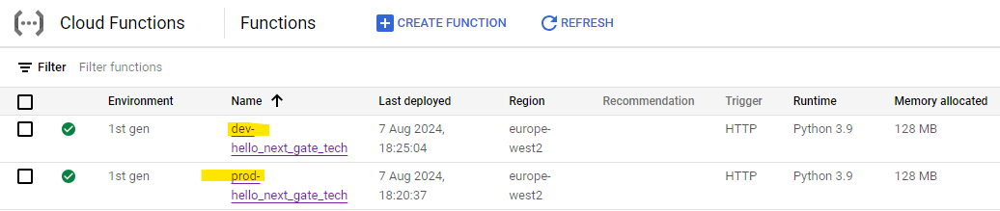

# Next Gate Tech Platform Engineering Assignment

## Overview

This repository contains a Platform Engineering assignment for Next Gate Tech.

## Repository Structure

```
.
├── README.md
├── main.py
├── requirements.txt
├── terraform
│   └── main.tf
└── tests
    ├── __init__.py
    └── test_app.py
```

## Objectives

1. Set up a CI/CD pipeline using GitHub Actions.
2. Deploy a Google Cloud Function with stages for `dev` and `prod` environments.
3. Provision necessary access using Terraform.
4. Create an SDK (A software development kit)

## CI/CD Pipeline details

The CI/CD pipeline is defined in `.github/workflows/ci-cd.yml`. It includes the following stages:

- **Build and Test**: Lints the code, runs tests, and verifies the deployment package.
- **Deploy**: Deploys the Google Cloud Function using Terraform. This includes a step to destroy any existing infrastructure to ensure a clean state.

### Build and Test

The build and test stage includes:

- **Checking out the code**: Uses the `actions/checkout@v4` action to pull the latest code from the repository.
- **Setting up Python**: Uses the `actions/setup-python@v4` action to set up the Python environment.
- **Installing dependencies**: Installs the required packages using `pip`.
- **Linting the code**: Runs `flake8` to ensure code quality.
- **Running tests**: Executes tests using `pytest`.

### Deploy

The deploy stage includes:

- **Checking out the code**: Uses the `actions/checkout@v4` action to pull the latest code from the repository.
- **Authenticating to Google Cloud**: Uses the `google-github-actions/auth@v2` action to authenticate with Google Cloud using a service account.
- **Setting up Google Cloud SDK**: Uses the `google-github-actions/setup-gcloud@v2` action to set up the Google Cloud SDK.
- **Creating deployment package**: Packages the Cloud Function into a zip file.
- **Verifying deployment package content**: Ensures the zip file is valid and contains the correct content.
- **Uploading the package to GCS**: Uploads the deployment package to Google Cloud Storage.
- **Initializing Terraform**: Configures the backend and prepares for deployment using the `terraform init` command.
- **Destroying infrastructure**: Ensures previous deployments are cleaned up using the `terraform destroy` command.
- **Applying Terraform**: Deploys the Cloud Function using the `terraform apply` command.


### Branching Strategy

The pipeline supports `dev` and `prod` environments, distinguished by the branch name:

- **Dev**: Triggered by pushes to the `dev` branch.
- **Prod**: Triggered by pushes to the `main` branch.

Environment-specific configurations, such as the state file prefix and Cloud Function name, are managed using environment variables. Thus, a push on the dev branch will create a cloud function with a `dev-` prefix and a push to the main branch will create a cloud function with a `prod-` prefix. 



### Technical Details

The CI/CD pipeline runs on `ubuntu-latest`, which is a "shared runner" provided by GitHub Actions.


## Decisions and Challenges

### Tracking Changes in Zip Files

Initially, Terraform did not track changes in the zip file used for the Cloud Function. To ensure that Terraform detects changes and redeploys the function accordingly, I decided to include a unique name for the zip file in each pipeline run. This approach guarantees that updates to the function are always applied despite there not being infra changes. However, when I managed to get Terraform to recognize that the zip file had changed, I encountered another issue:

```
data.google_storage_bucket.function_bucket: Reading...
data.google_storage_bucket.function_bucket: Read complete after 0s [id=next-gate-tech-project-functions]
google_cloudfunctions_function.function: Refreshing state... [id=projects/next-gate-tech-project/locations/europe-west2/functions/hello_next_gate_tech]
Terraform used the selected providers to generate the following execution
plan. Resource actions are indicated with the following symbols:
 ~ update in-place
Terraform will perform the following actions:
 # google_cloudfunctions_function.function will be updated in-place
 ~ resource "google_cloudfunctions_function" "function" 
 id = "projects/next-gate-tech-project/locations/europe-west2/functions/hello_next_gate_tech"
 name = "hello_next_gate_tech"
 ~ source_archive_object = "function_1722984208.zip" -> "function_1722984375.zip"
 # (28 unchanged attributes hidden)
 
Plan: 0 to add, 1 to change, 0 to destroy.
google_cloudfunctions_function.function: Modifying... [id=projects/next-gate-tech-project/locations/europe-west2/functions/hello_next_gate_tech]
╷
│ Error: Error while updating cloudfunction configuration: googleapi: Error 400: Default service account 'github-actions-deploy@next-gate-tech-project.iam.gserviceaccount.com' doesn't exist. Please recreate this account or specify a different account. Please visit https://cloud.google.com/functions/docs/troubleshooting for in-depth troubleshooting documentation., failedPrecondition
│
│ with google_cloudfunctions_function.function,
│ on main.tf line 22, in resource "google_cloudfunctions_function" "function":
│ 22: resource "google_cloudfunctions_function" "function" ***
│
```

This error indicates that the default service account `github-actions-deploy@next-gate-tech-project.iam.gserviceaccount.com` does not exist, despite it being present, of course and being able to do a clean terraform apply every time. This issue only arises when the zip file name is updated, suggesting that Terraform's incremental update process somehow mismanages the service account configuration?

However, when I use the destroy and recreate approach, Terraform performs a more thorough reconfiguration, which seems to avoid this issue. This discrepancy could imply a problem in my setup or a limitation in how Terraform handles partial updates to Google Cloud Functions, specifically related to service account handling during in-place updates. By forcing a full destroy and recreate, I bypass this problem, ensuring that the correct service account configuration is applied consistently but I do fully recognize potential drawbacks of this approach.

### Service Account Permissions

To deploy the Cloud Function and manage resources, I used a service account (`github-actions-deploy@next-gate-tech-project.iam.gserviceaccount.com`). I encountered several permissions issues, which required careful management of IAM roles. The following roles were granted to the service account:

- **Service Account User**: To allow the service account to act as other service accounts.
- **Cloud Functions Developer**: To deploy and manage Cloud Functions.

I used the following `gcloud` commands to grant these roles:

```bash
gcloud projects add-iam-policy-binding next-gate-tech-project \
  --member="serviceAccount:github-actions-deploy@next-gate-tech-project.iam.gserviceaccount.com" \
  --role="roles/iam.serviceAccountUser"

gcloud projects add-iam-policy-binding next-gate-tech-project \
  --member="serviceAccount:github-actions-deploy@next-gate-tech-project.iam.gserviceaccount.com" \
  --role="roles/cloudfunctions.developer"

```

### Backend Configuration

To manage state consistently across environments, I used a GCS backend for Terraform. The backend configuration is passed as environment variables during the `terraform init` step, ensuring the correct state file is used for each environment (`dev` or `prod`).

### Required APIs

To successfully deploy and manage the Cloud Functions using Terraform, I had to enable several Google Cloud APIs. The APIs I enabled are:

- **Cloud Functions API**: Allows the creation and management of Cloud Functions.
- **Cloud Build API**: Required for building and deploying Cloud Functions.
- **IAM Service Account Credentials API**: Manages and retrieves service account credentials.
- **Cloud Storage API**: Manages the storage of deployment packages and Terraform state files.
- **Cloud Resource Manager API**: Provides methods for creating, reading, and modifying Google Cloud resources.
